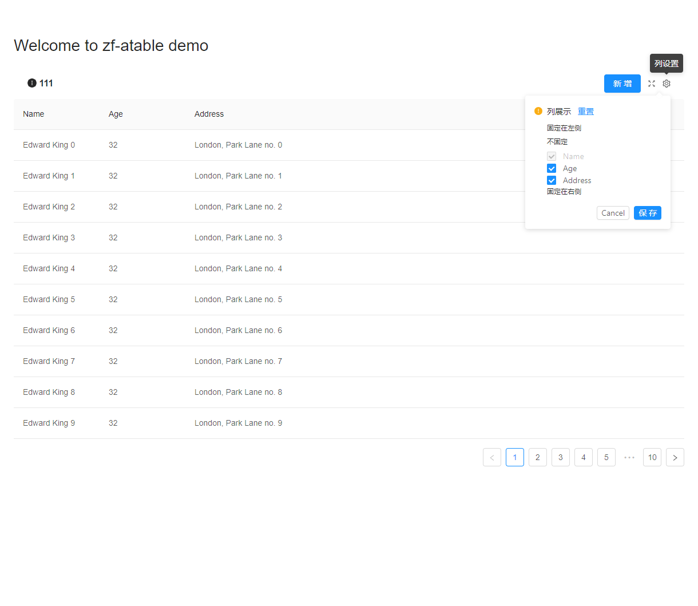

# zf-a-table demo
介绍：zf-table是基于ant-design-vue a-table封装的一个表格组件 ,依赖于ant design vue 
# antd-demo

支持功能，左上标题自定义，右上按钮配置，全屏，自定义设置展示列

##### props
`title` 表格标题  
`tableKey` 用于缓存表格column的key，因使用缓存localstorage时候吧tableKey作为Key，所以每次更改column需更改tableKey  
` iconReload（false）"` 是否展示刷新按钮  
其它props参考ant-design-vue（https://www.antdv.com/components/table-cn/）
#### columns
columns 新增两个属性   
checked: Bool // 是否默认展示  (默认true)
disabled: Bool // 是否禁用操作（默认false）
##### event
`reload` 刷新回调
### slot
` v-slot:leftTitle` 表格左侧头   
`v-slot:button` 表格右上头
```
<zf-a-table    
    :columns="columns"
    :data-source="data">
    <template v-slot:button>
       <a-button type="primary">hello2</a-button>
    </template>
     <template v-slot:leftTitle>
        <div class="table-title-info">
          <a-icon type="info-circle" class="primary-color" theme="filled" />
           111
        </div>
      </template>
      <template v-slot:button>
        <a-button type="primary"  >新增</a-button>
      </template>
   </zf-a-table>
```

## Project setup
```
yarn install
```

### Compiles and hot-reloads for development
```
yarn serve
```

### Compiles and minifies for production
```
yarn build
```

### Lints and fixes files
```
yarn lint
```

### Customize configuration
See [Configuration Reference](https://cli.vuejs.org/config/).
